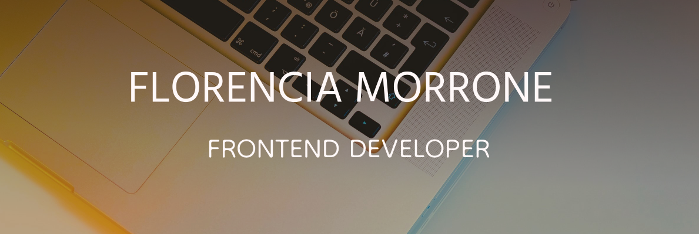

## Hola gente! 

Soy estudiante avanzada de la tecnicatura de desarrollo de software en la Universidad de Ezeiza.
Todos los proyectos que se encuentran en mis repos son practicas que surgieron estudiando por mi cuenta.

## 🛠️Tecnologías:

🌱Actualmente estoy estudiando 

## 📈Mis estadisticas:

## ✏️Si querés contactate conmigo:

